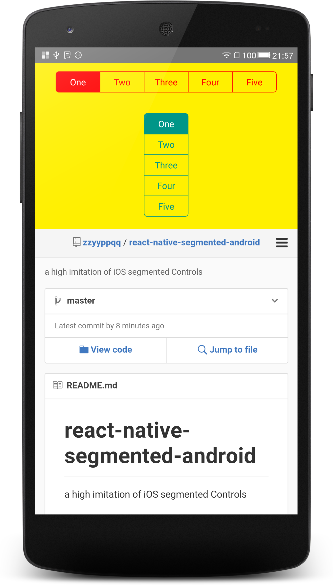

# react-native-segmented-android
a high imitation of iOS segmented Controls



## Example

```js
'use strict';

var React = require('react-native');
var {
  AppRegistry,
  StyleSheet,
  Text,
  Dimensions,
  ToastAndroid,
  View,
} = React;

var AndroidSegmented = require('react-native-segmented-android');
var deviceWidth = Dimensions.get('window').width;
var deviceHeight = Dimensions.get('window').height;

var ReactNativeSegmentedExample = React.createClass({
  onSelectPosition:function(event){
    console.log(event);
    ToastAndroid.show('segment '+event.selected, ToastAndroid.SHORT)
  },
  render: function() {
    return (
      <View>
          <AndroidSegmented
            tintColor={['#ff0000','#ffffff']}
            style={{width:deviceWidth,height:60,backgroundColor:'#fff000',
                  justifyContent: 'center',
                  alignItems: 'center'}}
            childText={['One','Two','Three','Four',"Five"]}
            orientation='horizontal'
            selectedPosition={0}
            onChange={this.onSelectPosition} />

            <AndroidSegmented
              tintColor={['#009688','#ffffff']}
              style={{width:deviceWidth,height:200,backgroundColor:'#fff000',
                    justifyContent: 'center',
                    alignItems: 'center'}}
              childText={['One','Two','Three','Four',"Five"]}
              orientation='vertical'
              selectedPosition={0}
              onChange={this.onSelectPosition} />
        </View>
    );
  }
});

```

## Install

### Step 1 - Install the npm package

```sh
$ npm install react-native-segmented-android --save
```

### Step 2 - Update Gradle Settings

```gradle
// file: android/settings.gradle
...

include ':react-native-segmented-android', ':app'
project(':react-native-segmented-android').projectDir = new File(rootProject.projectDir,'../node_modules/react-native-segmented-android')
```

### Step 3 - Update app Gradle Build

```gradle
// file: android/app/build.gradle
...

dependencies {
    ...
    compile project(':react-native-segmented-android')
}
```

### Step 4 - Register React Package

```java
...
import com.higo.zhangyp.segmented.AndroidSegmentedPackage; // <-- import

public class MainActivity extends FragmentActivity implements DefaultHardwareBackBtnHandler {

    private ReactInstanceManager mReactInstanceManager;
    private ReactRootView mReactRootView;

    @Override
    protected void onCreate(Bundle savedInstanceState) {
        super.onCreate(savedInstanceState);
        mReactRootView = new ReactRootView(this);
        mReactInstanceManager = ReactInstanceManager.builder()
                .setApplication(getApplication())
                .setBundleAssetName("index.android.bundle")
                .setJSMainModuleName("index.android")
                .addPackage(new MainReactPackage())
                .addPackage(new AndroidSegmentedPackage()) // <-- Register package here
                .setUseDeveloperSupport(BuildConfig.DEBUG)
                .setInitialLifecycleState(LifecycleState.RESUMED)
                .build();
        mReactRootView.startReactApplication(mReactInstanceManager, "AwesomeProject", null);
        setContentView(mReactRootView);
    }
...
